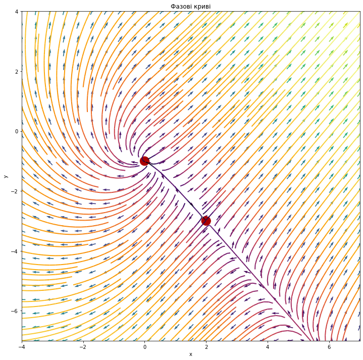

# Phase-Portrait-Non-Linear-System
Build a phase portrait for an autonomous system

## Setup

Clone the repository and change the working directory:

    git clone https://github.com/SvNext/Phase-Portrait-Non-Linear-System.git
    cd Phase-Portrait-Non-Linear-System
Create and activate the virtual environment:

    python3 -m venv env
    source env/bin/activate
Install requirements:

    pip install -r requirements.txt

Run the jupyter notebook:

    jupyter notebook phase_portrait.ipynb
    
    
## Results

Enter your own system of equations in matrix form and run all cells

